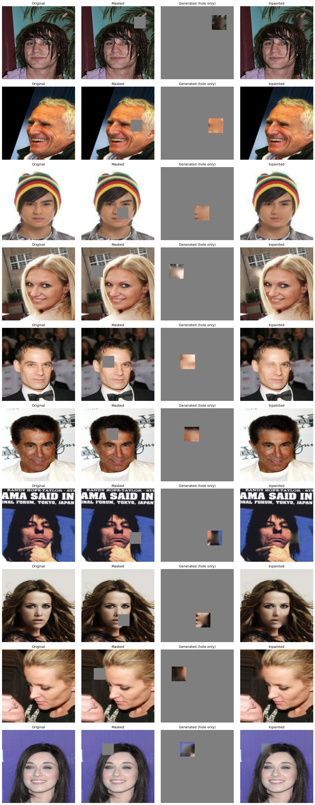
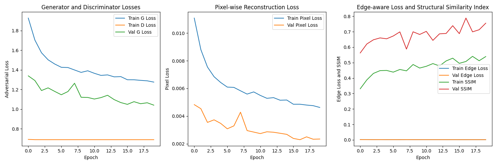
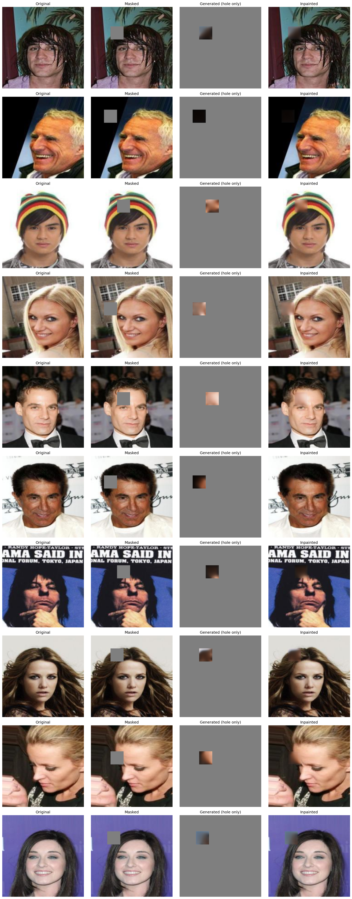
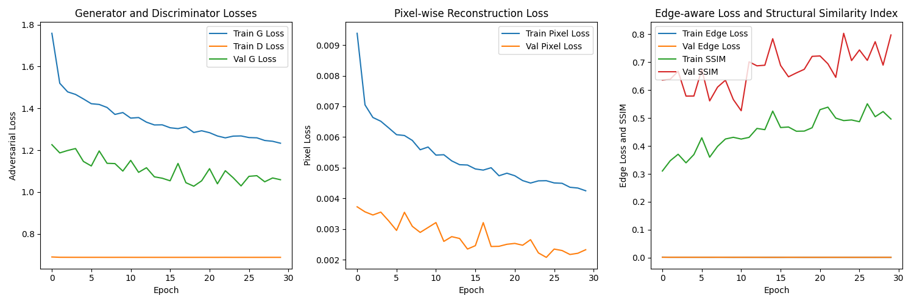

# Image Inpainting with GAN

## Project Points Summary

| Category | Item | Points |
|----------|------|--------|
| Problem | Image inpainting | 3 |
| Model | Own architecture (over 50% of own layers) | 2 |
| | Sobel loss function | 1 |
| | Self-attention mechanism | 1 |
| | GAN architecture | 1 |
| Dataset | Over 1000 CelebA photos | 0 |
| Training | Data split (train/val/test) | 0 |
| | Hyperparameter tuning or estimation | 1 |
| | Multiple metrics (SSIM, L1, Edge-aware, GAN loss) | 1 |
| | Data augmentation | 1 |
| Tools | Git with README | 0 |
| **Total Points** | | **11** |

## Project Description
This project implements an image inpainting system using Generative Adversarial Networks (GANs). Image inpainting is the task of filling in missing or damaged parts of images in a visually plausible way. The system uses a combination of adversarial and pixel-wise losses to generate realistic completions for masked regions in images.

## Model Architecture

### Network Architecture Diagram


### Generator Network (4.88M parameters)
The generator follows a U-Net style architecture with skip connections and self-attention mechanisms:

1. **Encoder Path**:
   - `enc1`: Initial feature extraction (39,296 params)
     - Input: 200x200x3 masked image
     - Output channels: 64
   - `enc2`: Mid-level feature extraction (221,440 params)
     - Progressive feature learning
     - Deeper semantic understanding
   - `enc3`: High-level feature encoding (885,248 params)
     - Complex pattern recognition
     - Abstract feature representation

2. **Attention Module** (82,241 params):
   - Self-attention mechanism for global context
   - Helps understand relationships between distant image regions
   - Critical for coherent hole filling

3. **Bottleneck** (1,180,160 params):
   - Densest layer of the network
   - Captures the most abstract representations
   - Bridges encoder and decoder paths

4. **Decoder Path**:
   - `dec3`: High-level feature decoding (1,769,984 params)
     - Combines upsampled features with skip connections
   - `dec2`: Mid-level reconstruction (590,080 params)
     - Progressive refinement of features
   - `dec1`: Final reconstruction (112,387 params)
     - Output: Complete 200x200x3 image
     - Fine detail generation

Each encoder block is followed by max pooling (`pool1`, `pool2`, `pool3`) for spatial dimension reduction. The decoder uses upsampling (`up1`, `up2`, `up3`) to restore spatial dimensions.

### Discriminator Network (35.5K parameters)
A lightweight PatchGAN discriminator that focuses on local image coherence:
- Uses a fully convolutional architecture
- Classifies if each image patch is real or fake
- Small parameter count (35,553) enables stable training
- Effective at capturing local texture and style consistency

### Key Design Features:
1. **Skip Connections**: Enable direct information flow between encoder and decoder
2. **Self-Attention**: Helps maintain global consistency in generated content
3. **Progressive Processing**: Gradually increases receptive field for better context understanding
4. **Balanced Architecture**: Generator complexity (4.88M params) vs. lightweight discriminator (35.5K params)

## Dataset Description
The project uses the CelebA (CelebFaces Attributes) dataset, which is a large-scale face attributes dataset with more than 200,000 celebrity images. For this project, we use a subset of 1024 images, each containing:
- High-quality face photographs
- Resolution of 200x200 pixels after preprocessing
- RGB color format
- Diverse facial features, expressions, and poses

### Data Processing
1. **Image Preprocessing**:
   - Images are resized to 200x200 pixels
   - Normalized to [-1, 1] range
   - Converted to RGB format

2. **Masking Process**:
   - Random square masks of size 32x32 pixels
   - Mask position is randomly selected with a margin of 16 pixels from edges
   - Additional 4-pixel context region around the mask for better blending
   - Two mask types:
     - Training: Random positions for each batch
     - Testing: Fixed positions for consistent evaluation

3. **Data Split**:
   - Training: 80% (819 images)
   - Validation: 10% (102 images)
   - Testing: 10% (103 images)

### Example Images
The `out` directory contains example results showing:
- Original images
- Masked images (with 32x32 hole)
- Generated hole content
- Final inpainted results

#### Random Test Samples


You can find these results in:
- `inpainting_results.png`: Random test samples with varying mask positions

## Training Configuration
- **Dataset**: CelebA dataset with face images
- **Split**: Train/Validation/Test
- **Loss Functions**:
  - Adversarial loss (GAN loss)
  - L1 pixel-wise loss
  - Edge-aware loss
  - SSIM loss
- **Optimizers**: Adam for both Generator and Discriminator
- **Data Augmentation**: Random masking positions and sizes

### Training Time
- 180 seconds per epoch on MPS (Metal Performance Shaders)
- Total training time: ~1 hour for 20 epochs

### Inference Time
- Inference time: 0.29 seconds per batch on MPS (Metal Performance Shaders)

### Hyperparameters
1. **Network Architecture**:
   - Generator base channels: 64 (chosen to balance model capacity and training speed)
   - Discriminator base channels: 32 (lightweight design for stable GAN training)
   - Attention dimension: channels/8 (reduced dimension for efficient self-attention)

2. **Optimization**:
   - Learning rate: 0.0002 (standard for GAN training, helps prevent mode collapse)
   - Adam betas: (0.5, 0.999) (β1=0.5 helps stabilize GAN training)
   - Batch size: 20 (balanced between memory usage and training stability)
   - Number of epochs: 20 (sufficient for convergence on this dataset)

3. **Mask Configuration**:
   - Size: 32x32 pixels (approximately 1/4 of image size)
   - Context region: 4-pixel dilation (helps blend inpainted region)

4. **Loss Weights**:
   - Adversarial loss: 1.0 (balances realism)
   - Pixel L1 loss: 100.0 (ensures structural accuracy)
   - Edge-aware loss: 10.0 (preserves edge continuity)
   - SSIM loss: 1.0 (maintains perceptual quality)

### Loss Graph


## Alternative Architecture: Whole Image Processing
This variant of the architecture processes the entire image at once, instead of focusing on the hole and its immediate surroundings. This approach allows the model to leverage full image context for more coherent inpainting.

### Key Differences
- Takes the complete masked image as input without additional padding
- Processes the entire 200x200 image in one pass
- Generator uses 32 base channels (compared to 64 in the original)
- More memory efficient due to simpler architecture

### Training Details
- 80 seconds per epoch on MPS
- Total training time: ~40 minutes for 30 epochs
- Trained on 1000 images from CelebA dataset
- Batch size: 20 images

### Results

*Example inpainting results showing original images, masked inputs, and generated outputs*


*Training progress showing loss convergence and SSIM improvement over epochs*

## Setup and Usage
1. Install dependencies:
```bash
pip install -r requirements.txt
```

2. Training:
```bash
python main.py
```

3. Inference:
```bash
python results.py
```

## Requirements
You can find all required packages in `requirements.txt`:
- torch>=2.0.0
- torchvision>=0.15.0
- Pillow>=9.0.0
- numpy>=1.21.0
- matplotlib>=3.0.0
- scikit-image>=0.19.0

## Bibliography
1. CelebA Dataset: Liu, Z., Luo, P., Wang, X., & Tang, X. (2015). Deep Learning Face Attributes in the Wild. In Proceedings of International Conference on Computer Vision (ICCV).

## Repository
[GitHub Repository](https://github.com/Farmerobot/image_inprinting)